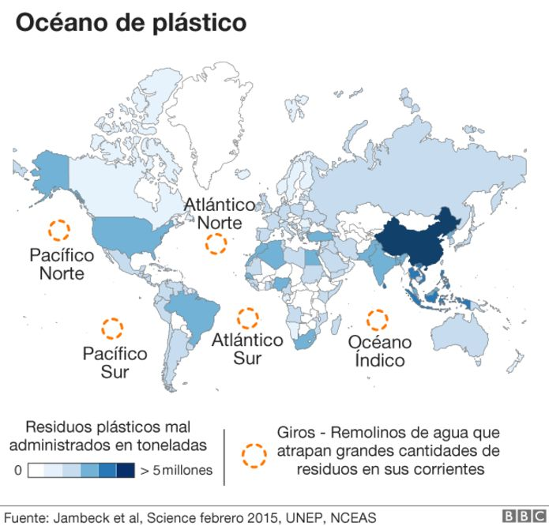

# THE-OCEAN
## Problematica 

Uno de los mayores problemas que encontramos en los océanos son las islas de basura, las cuales se generan por los desechos que las empresas, embarcaciones, plataformas o turistas y personas que viven cerca de cuerpos de agua y solo tiran la basura ahí, lo que hace que sea llevada por las corrientes marinas hasta cierto punto de los océanos donde se concentra una gran cantidad de desechos creando lo que se llama "Islas de basura". Como se puede ver a continuación este es un problema de gran magnitud

## Solución

Evitar que la basura llege a los océanos, esto sera posible, creando , donde se haga conciencia del daño que causa tirar la basura en los océanos, se prodrá observar los daños que ya han causado en varios lugares del país, al igual que llene un formulario y darle una solución al desechar residuos, en lugar de que estos colaboren con el creciemiento de las islas de basura.

## Público objetivo

Empresario millenias que inicien una Startup, y produzcan desechos plásticos y estén dispuestos a adoptar medidas de reciclaje mediante un plan de negocios.

## Buyer persona

Personas de entre 18 a 35, sin importar el género.

##Diagrama de solución

En el siguiente enlace se podrá encontrar el diagrama deseñado en la página de Miro: https://miro.com/app/board/uXjVO0qHyDI=/?share_link_id=173608525418

# Partes que componen el sitio

## Inicio 

En esta parte se podrá visualizar una pequeña historia de como la basura viaja hasta llegar a ser parte de una isla de basura, con la finalidad de concientizar a las personas de los daños que causan al contaminar los océanos, con la finalidad de tener algo mas interactivo y llamativo en lugar de solo tener texto estatico que muchas veces es aburrido.

## Mapa

Aquí tendremos un mapa donde se mostrarán ciertos puntos, tales como la isla de basura más cercana a nuestro país, algunas de las islas más contamidas, y de la misma forma el usuario podrá visualizar cierta información sobre esos sitios, para que puedan observar de una manera más real el daño que se a hecho a muchos lugares turisticos. 

## Formulario 1

Los usuarios llenaran un formulario con la finalidad de saber que tanto llegarian a contribuir con las islas de basura si los desechos llegarán.
